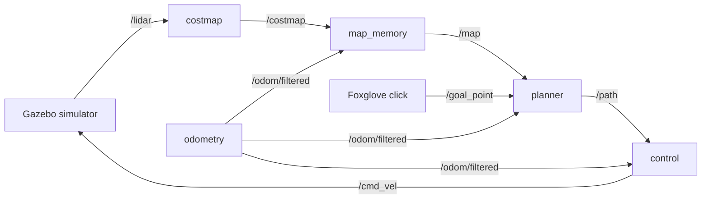

# ros2-autonomous-navigation
A modular ROS 2 Humble (C++) autonomous navigation pipeline for differential-drive robots. Integrates 2D LiDAR costmaps, persistent map memory, A* global path planning, and Pure Pursuit motion control in simulation.

Click a point in Foxglove and the simulated robot plans a route around the obstacles and drives there.

**[▶ Watch the demo video](https://drive.google.com/file/d/1Ttzek0rLZ-83s_e8tNnNfj-8D2mpI1om/view?usp=sharing)**

## How it works



Every package separates ROS plumbing from the algorithm: `*_node.cpp` only subscribes, publishes and reads
parameters, while the algorithm lives in a `robot::*Core` class with no ROS I/O, unit tested on its own.

| Node | What it does | Key design choices |
|---|---|---|
| **costmap** | Turns each lidar scan into a 40 × 40 m, 0.1 m grid centred on the robot | A hit costs 100, falling linearly to 0 over 2.5 m. A precomputed stencil is stamped around each hit, keeping the higher cost where zones overlap. |
| **map_memory** | Stitches the costmaps into one 40 × 40 m map of the arena, published every second | Each costmap is placed at the robot's pose at the moment of its scan, interpolated between the odometry readings either side. Merge = max(old, new), because the world is static. Every map cell looks up the costmap cell under it, so a rotated costmap leaves no holes. Merges after 1.5 m of travel or 2 s, never while turning fast. |
| **planner** | A\* from the robot to the clicked goal | 8-connected grid with an octile heuristic. Entering a cell costs its length × (1 + 3 · cost / 100), so paths keep to the middle of gaps. Cost ≥ 34 (within 1.65 m of an obstacle) is blocked. Goals need 2 m of clearance so the robot can turn on the spot when it leaves; closer goals move up to 2.5 m to get it. Replans every 0.5 s; an empty path means stop. |
| **control** | Pure pursuit along the path, 10 Hz | Steers toward the path point 1.8 m ahead with curvature 2y / L², at 1.5 m/s. Turns on the spot when the target is behind. When the turn rate would exceed 1.5 rad/s it slows down rather than widening the arc. Stops with a single zero command. |

### Node interfaces
| Node | Subscribes | Publishes | Timer | Code |
|---|---|---|---|---|
| costmap | `/lidar` (LaserScan) | `/costmap` (OccupancyGrid) | none, runs per scan | [node](src/robot/costmap/src/costmap_node.cpp), [algorithm](src/robot/costmap/src/costmap_core.cpp) |
| map_memory | `/costmap` (OccupancyGrid), `/odom/filtered` (Odometry) | `/map` (OccupancyGrid) | 1 Hz: merge when due, republish the map | [node](src/robot/map_memory/src/map_memory_node.cpp), [algorithm](src/robot/map_memory/src/map_memory_core.cpp) |
| planner | `/map` (OccupancyGrid), `/goal_point` (PointStamped), `/odom/filtered` (Odometry) | `/path` (Path) | 2 Hz: check arrival and timeout, replan | [node](src/robot/planner/src/planner_node.cpp), [algorithm](src/robot/planner/src/planner_core.cpp) |
| control | `/path` (Path), `/odom/filtered` (Odometry) | `/cmd_vel` (Twist) | 10 Hz control loop | [node](src/robot/control/src/control_node.cpp), [algorithm](src/robot/control/src/control_core.cpp) |

## Things the simulator doesn't tell you
Found by reading the simulator's source and checking in the running sim:

- **Odometry is the lidar's pose, not the robot's.** `/odom/filtered` tracks `robot/chassis/lidar`, which sits 1.3 m ahead
  of the wheel axle the robot turns around.
- **There is no `map` frame.** `/map` and `/path` are published in `sim_world`; the costmap keeps the scan's own frame.
- **The robot never stops by itself.** The simulator's diff-drive keeps executing the last `/cmd_vel` it received.
- **The robot needs more room to turn than to drive.** It is 1.4 m wide, but turning on the spot sweeps its front corner
  through a 1.58 m circle around the axle.
- **`./watod down robot` removes every container**, not just the robot. To rebuild only the robot:
  `./watod build robot && ./watod up -d robot`.

## Design decisions and the alternatives I rejected
- **Merge with max, not overwrite.** Overwriting map cells with each new costmap looks natural, but the costmap marks
  everything its lidar didn't hit as free, including the space hidden *behind* an obstacle. Overwriting would erase
  obstacles as soon as something else blocked the view. The world is static, so a cell keeps the highest cost ever seen.
- **No holes without a finer costmap.** Rotating a costmap and pushing its cells into the map leaves gaps between cells;
  a common workaround is making the costmap finer than the map. Instead, each *map* cell looks up the costmap cell it
  falls in, which can't leave holes at any resolution, so both grids stay at 0.1 m.
- **Update the map by distance or time.** Merging only after 1.5 m of travel saves work, but a robot standing still
  never refreshes its map. That broke cold starts (the first scans arrive before the world has loaded), so the map also
  merges every 2 s. It never merges while turning fast, when small timing errors would smear obstacles.
- **Place each scan at the pose it was taken from.** Scans and odometry arrive at different moments, so each costmap
  waits until odometry exists on both sides of its timestamp and the pose is interpolated. Pairing it with the latest
  odometry instead put distant walls up to 0.4 m off.
- **Plan and steer from the wheel axle, not the odometry frame.** The robot turns about its axle, 1.3 m behind the
  lidar. Pure pursuit's geometry assumes the point being steered is the turning centre, and the axle's velocity is what
  `/cmd_vel` commands. Mapping still uses the lidar pose, because that is where the scans come from.
- **Block the turning circle, not the half-width.** Blocking cells within 0.96 m of an obstacle (half the width plus a
  margin) lets the robot drive through, but a turn on the spot there clips the obstacle. The planner blocks 1.65 m, so
  the robot can turn anywhere on a path; gaps narrower than about 3.3 m are the price.
- **Flat arrays for A\*, not a hash map of cells.** The grid has a fixed size, so every per-cell value (cost so far,
  parent, visited) lives in a vector indexed by `y * width + x`. That is simpler and faster than hashing cell
  coordinates; a plan across the arena takes 0.2–6.2 ms.
- **Slow down rather than cut corners.** When a curve needs more than 1.5 rad/s of turning, the controller keeps the
  curvature and lowers the speed, so the robot stays on the planned line instead of swinging wide.
- **Top speed is set by physics, not ambition.** The simulator applies speed changes instantly, so at 3 m/s the light
  robot pitched up to 16°, tilting the lidar into the floor; tilted scans carried ~40 phantom hits each against ~1
  when level, and the map filled with fake obstacles. At 1.5 m/s pitch stays under about 3°. The lookahead is 1.8 m:
  a longer one (2.5 m) cuts too far inside curves, a shorter one weaves at this speed. Going faster would first need
  acceleration limiting in the controller.
- **Stop with one command.** Since the simulator keeps executing the last command, stopping has to be explicit; after
  one zero command the controller goes silent, so manual teleop still works whenever the robot is idle.

## Results
**[▶ Demo video](https://drive.google.com/file/d/1Ttzek0rLZ-83s_e8tNnNfj-8D2mpI1om/view?usp=sharing)**: clicked
goals in Foxglove, the robot planning around obstacles, squeezing through the tightest gap, and replanning mid-trip.

Measured in the running simulator against the true obstacle positions from the world file, using the robot's full
2 m × 1.4 m outline. This is the final run: a cold `./watod up` of this repo and ten trips at 1.5 m/s starting from
the spawn point, after the fixes described below.

| Scenario | Outcome | Closest the robot's body got to an obstacle |
|---|---|---|
| First goal right after startup, behind the cylinder the robot faces | arrived | 1.04 m |
| Goal clicked 1 m from a box | arrived; goal moved out to leave turning room | 0.62 m |
| Then a goal behind the robot, clicked 1.4 m from the big cylinder | arrived; goal moved out | 0.66 m |
| Then a goal behind again | arrived | 0.90 m |
| New goal given in the middle of a trip | arrived | 0.64 m |
| Tightest gap in the arena (3.75 m, box to south wall) | arrived | 1.07 m |
| Gap between the two south-east boxes | arrived | 1.19 m |
| Three long trips across the arena (10–18 s each) | arrived | 1.17 m or more |

- **10 of 10 goals reached with no contact**, all ten trips in 119 s. A path across the whole arena plans in 0.2–6.2 ms.
- **The map is accurate.** After all ten trips, `/map` holds 3,893 obstacle cells: 99% lie within 0.10 m of a real
  surface, the worst is 0.20 m off, and none are phantoms (more than 0.25 m off).
- **The map is ready at startup.** After a cold `./watod up`, `/map` shows the real obstacles within about 7 s.
- **Idle means silent.** When it has no path the controller publishes nothing, so Foxglove's teleop panel works.

### What the stress tests caught
1. **Turning clipped a box.** The first version only blocked cells within 0.96 m of an obstacle (half the robot's width
   plus a margin). A goal 1 m from a box was accepted, the next trip began by turning on the spot, and the robot's front
   corner hit the box. The blocked zone now covers the turning circle.
2. **Moved goals never "arrived".** Goals clicked near obstacles are moved away from them, but arrival was still measured
   to the clicked point, so the robot waited at the end of its path until the 90 s timeout. Arrival is now measured to
   where the path ends, and goals are parked 2 m clear so the robot can always turn when it leaves.
3. **The map started empty.** On a fresh `./watod up`, the first lidar scans arrive before Gazebo has loaded the
   world. The map merged one of those empty scans, then waited for 1.5 m of travel before merging again, so a goal
   clicked straight away could be planned through the cylinder in front of the robot. The map now also merges
   every 2 s while the robot isn't moving. This one only showed up when testing from a fresh clone.
4. **Walls grew phantom edges.** After ten trips, 29 of the map's ~5,000 obstacle cells sat up to 0.4 m away from any
   real surface. Each costmap was paired with the newest odometry *when it arrived*, but the reading from just after
   the scan hadn't arrived yet, so the pose used was up to 97 ms old. During a gentle turn that is enough to swing a
   wall 15 m away by 0.4 m. Costmaps now wait until odometry exists on both sides of their scan, and the pose at the
   scan time is interpolated.
5. **Driving faster starved the map.** At 1.5 m/s the robot grazed the big cylinder on three runs out of three. The
   controller was tracking its path fine: the *path* ran 0.18 m from the real cylinder, because the far side had
   never reached the map. The map refused to merge while turning faster than 0.3 rad/s, a guard from before scans
   were time-matched, and at 1.5 m/s every curve around an obstacle turns faster than that. With the guard at
   1.0 rad/s (still blocking fast spins on the spot) the same trip clears the cylinder by 1.05–1.11 m.

## Extending the system
- **On a real robot.** The navigation nodes only talk to `/lidar`, `/odom/filtered` and `/cmd_vel`, so the Gazebo
  bridge would be swapped for the lidar and motor-controller drivers publishing the same topics. Real scans are noisy,
  and the max-merge would keep every false return forever, so the map would need probabilistic updates (below).
- **Localisation.** Here odometry is perfect. A real robot would fuse wheel odometry and an IMU in an EKF, then correct
  drift with AMCL against a known map or with SLAM. Map memory would then have to cope with the pose being corrected
  after scans were already merged.
- **More sensors.** Cameras, radar or sonar become extra costmap layers merged into the same grid by max. A depth camera
  catches obstacles above or below the lidar's single scan plane; a camera adds meaning, such as keeping extra
  distance from people.
- **Moving obstacles.** Max-merge never forgets, so a walking person would leave a permanent trail. That needs raytraced
  clearing (cells a beam passes through become free again), log-odds occupancy that decays, and a local planner or
  controller that checks the live costmap every cycle rather than trusting a path planned seconds ago.
- **Smarter decisions.** The planner's two-state machine would grow into a behaviour tree: waypoint lists, recovery
  behaviours (back up, rotate, clear the map, retry) and distinct handling for goals that can never be reached.
- **A different drivetrain.** A car-like robot, or two carts joined at a pivot, can't turn on the spot, so the
  turning-circle blocked zone and turn-in-place logic no longer apply. Planning would need a kinematically feasible
  search such as Hybrid A\* or a state lattice, and control would need the steering geometry and, for a trailer, the
  hitch angle to avoid jackknifing.

## Running it
Needs Docker on Linux, WSL2 (Windows) or macOS.

1. Clone and pick the modules to run:
   ```bash
   git clone https://github.com/MMahmoud27/ros2-autonomous-navigation.git
   cd ros2-autonomous-navigation
   echo 'ACTIVE_MODULES="robot gazebo vis_tools"' > watod-config.local.sh
   ```
2. Build and start the simulator, the robot and the Foxglove bridge (the first build downloads several GB):
   ```bash
   ./watod build
   ./watod up
   ```
3. In [Foxglove](https://foxglove.dev), open a WebSocket connection to `ws://localhost:<port>`. The port is your user ID × 20
   (`20000` for the usual ID of 1000); the Foxglove container logs `Server listening on port ...`.
4. Import the layout `config/wato_asd_training_foxglove_config .json` (the file name contains a space).
5. In the 3D panel, pick the **Publish** tool (point) and click where the robot should go.

Every tunable number lives in the node's `src/robot/<node>/config/params.yaml`.

## Tests
```bash
./scripts/run_unit_tests.sh
```
Builds the four packages in a throwaway container and runs 44 gtest cases: costmap 7, map memory 12, planner 14,
control 11. They were written before the code they test, with expected values worked out by hand
(for example, a target at (1.6, 1.2) m must give curvature 0.6). Two of them were also checked by breaking the code on
purpose: with walls made passable, the no-path tests fail; with the goal check removed, the stop test fails.

## Repository layout
| Path | |
|---|---|
| `src/robot/costmap`, `map_memory`, `planner`, `control` | the navigation stack |
| `src/robot/odometry_spoof`, `bringup_robot`, `src/gazebo`, `docker/`, `modules/`, `watod*` | the simulation environment and Docker tooling it runs on |
| `scripts/run_unit_tests.sh` | runs the unit tests |

## License
Apache-2.0, see [LICENSE](LICENSE).
