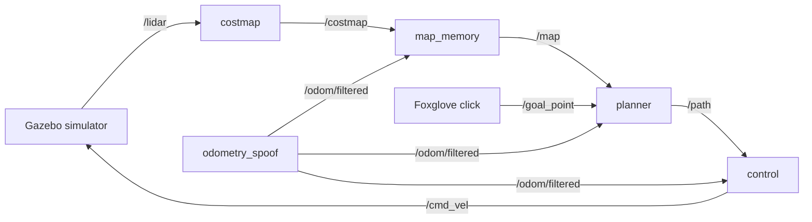

# ros2-autonomous-navigation
A modular ROS 2 Humble (C++) autonomous navigation pipeline for differential-drive robots. Integrates 2D LiDAR costmaps, persistent map memory, A* global path planning, and Pure Pursuit motion control in simulation.

Built for the [WATonomous ASD admission assignment](https://github.com/WATonomous/wato_asd_training): click a point in Foxglove and the simulated robot plans a route around the obstacles and drives there.

<!-- Demo video: add the link here -->

## How it works



Every package separates ROS plumbing from the algorithm: `*_node.cpp` only subscribes, publishes and reads
parameters, while the algorithm lives in a `robot::*Core` class with no ROS I/O, unit tested on its own.

| Node | What it does | Key design choices |
|---|---|---|
| **costmap** | Turns each lidar scan into a 40 × 40 m, 0.1 m grid centred on the robot | A hit costs 100, falling linearly to 0 over 2.5 m. A precomputed stencil is stamped around each hit, keeping the higher cost where zones overlap. |
| **map_memory** | Stitches the costmaps into one 40 × 40 m map of the arena, published every second | Each costmap is placed at the robot's pose at the moment of its scan, interpolated between the odometry readings either side. Merge = max(old, new), because the world is static. Every map cell looks up the costmap cell under it, so a rotated costmap leaves no holes. Merges after 1.5 m of travel or 2 s, never while turning fast. |
| **planner** | A\* from the robot to the clicked goal | 8-connected grid with an octile heuristic. Entering a cell costs its length × (1 + 3 · cost / 100), so paths keep to the middle of gaps. Cost ≥ 34 (within 1.65 m of an obstacle) is blocked. Goals need 2 m of clearance so the robot can turn on the spot when it leaves; closer goals move up to 2.5 m to get it. Replans every 0.5 s; an empty path means stop. |
| **control** | Pure pursuit along the path, 10 Hz | Steers toward the path point 1.5 m ahead with curvature 2y / L², at 0.8 m/s. Turns on the spot when the target is behind. When the turn rate would exceed 1 rad/s it slows down rather than widening the arc. Stops with a single zero command. |

## Things the handout doesn't tell you
Found by reading the simulator's source and checking in the running sim:

- **Odometry is the lidar's pose, not the robot's.** `/odom/filtered` tracks `robot/chassis/lidar`, which sits 1.3 m ahead
  of the wheel axle the robot turns around. The planner and controller work from the axle; mapping uses the lidar pose directly.
- **There is no `map` frame.** `/map` and `/path` are published in `sim_world`; the costmap keeps the scan's own frame.
- **The robot never stops by itself.** The simulator's diff-drive keeps executing the last `/cmd_vel`, so the controller
  sends one zero command to stop, then stays silent so Foxglove's teleop panel still works.
- **The robot needs more room to turn than to drive.** It is 1.4 m wide, but turning on the spot sweeps its front corner
  through a 1.58 m circle around the axle. A stress test caught a turn clipping a box when the blocked zone only covered
  the half-width, so the blocked zone now covers the turning circle (1.65 m).
- **`./watod down robot` removes every container**, not just the robot. To rebuild only the robot:
  `./watod build robot && ./watod up -d robot`.

## Results
Measured in the running simulator against the true obstacle positions from the world file, using the robot's full
2 m × 1.4 m outline. This is the final regression run, after the fixes described below:

| Scenario | Outcome | Closest the robot's body got to an obstacle |
|---|---|---|
| Goal clicked 1 m from a box | arrived; goal moved 1.3 m out to leave turning room | 1.11 m |
| Then a goal behind the robot, clicked 1.4 m from the big cylinder | arrived; goal moved 0.65 m | 0.65 m |
| Then a goal behind again | arrived | 0.87 m |
| New goal given in the middle of a trip | arrived | 0.68 m |
| Tightest gap in the arena (3.75 m, box to south wall) | arrived | 1.07 m |
| Gap between the two south-east boxes | arrived | 1.32 m |
| Three long trips across the arena (18–33 s each) | arrived | 0.72 m or more |

9 of 9 goals reached with no contact. A path across the whole arena plans in 0.2–6.2 ms. Every obstacle cell in `/map` lies within 0.15 m of a
real surface, with no phantom obstacles after driving and turning.

### What the stress tests caught
1. **Turning clipped a box.** The first version only blocked cells within 0.96 m of an obstacle (half the robot's width
   plus a margin). A goal 1 m from a box was accepted, the next trip began by turning on the spot, and the robot's front
   corner hit the box. The blocked zone now covers the turning circle.
2. **Moved goals never "arrived".** Goals clicked near obstacles are moved away from them, but arrival was still measured
   to the clicked point, so the robot waited at the end of its path until the 90 s timeout. Arrival is now measured to
   where the path ends, and goals are parked 2 m clear so the robot can always turn when it leaves.
3. **The map started empty.** On a fresh `./watod up`, the first lidar scans arrive before Gazebo has loaded the
   world. The map merged one of those empty scans, then waited for 1.5 m of travel before merging again, so a goal
   clicked straight away could be planned through the cylinder in front of the robot. The map now also merges
   every 2 s while the robot isn't moving. This one only showed up when testing from a fresh clone.
4. **Walls grew phantom edges.** After ten trips, 29 of the map's ~5,000 obstacle cells sat up to 0.4 m away from any
   real surface. Each costmap was paired with the newest odometry *when it arrived*, but the reading from just after
   the scan hadn't arrived yet, so the pose used was up to 97 ms old. During a gentle turn that is enough to swing a
   wall 15 m away by 0.4 m. Costmaps now wait until odometry exists on both sides of their scan, and the pose at the
   scan time is interpolated.

## Running it
Needs Docker on Linux, WSL2 (Windows) or macOS.

1. Clone and pick the modules to run:
   ```bash
   git clone https://github.com/MMahmoud27/ros2-autonomous-navigation.git
   cd ros2-autonomous-navigation
   echo 'ACTIVE_MODULES="robot gazebo vis_tools"' > watod-config.local.sh
   ```
2. Build and start the simulator, the robot and the Foxglove bridge (the first build downloads several GB):
   ```bash
   ./watod build
   ./watod up
   ```
3. In [Foxglove](https://foxglove.dev), open a WebSocket connection to `ws://localhost:<port>`. The port is your user ID × 20
   (`20000` for the usual ID of 1000); the Foxglove container logs `Server listening on port ...`.
4. Import the layout `config/wato_asd_training_foxglove_config .json` (the file name contains a space).
5. In the 3D panel, pick the **Publish** tool (point) and click where the robot should go.

Every tunable number lives in the node's `src/robot/<node>/config/params.yaml`.

## Tests
```bash
./scripts/run_unit_tests.sh
```
Builds the four packages in a throwaway container and runs 44 gtest cases: costmap 7, map memory 12, planner 14,
control 11. They were written before the code they test, with expected values worked out by hand
(for example, a target at (1.6, 1.2) m must give curvature 0.6). Two of them were also checked by breaking the code on
purpose: with walls made passable, the no-path tests fail; with the goal check removed, the stop test fails.

## Repository layout
| Path | |
|---|---|
| `src/robot/costmap`, `map_memory`, `planner`, `control` | the navigation stack (this project) |
| `src/robot/odometry_spoof`, `bringup_robot`, `src/gazebo`, `docker/`, `modules/`, `watod*` | simulation and tooling provided by WATonomous |
| `scripts/run_unit_tests.sh` | runs the unit tests |

## Credits
Assignment, simulator and Docker tooling by [WATonomous](https://github.com/WATonomous/wato_asd_training).
Developed with the help of Claude (Anthropic) as a pair programmer, which the assignment allows.
